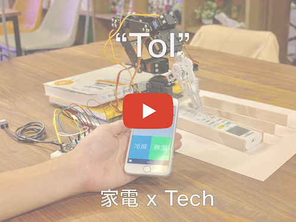

# ToI (トイ)

## 製品概要
### 家電 x Tech

### 背景（製品開発のきっかけ、課題等）
　現在5Gへの移行が目前に迫っており、エッジデバイスでの処理が注目され、いわゆるIoT家電など様々な機器が世に溢れてきている。
しかしながら、IoT化するにあたり改めて家電を買い換えるにはあまりに費用がかかりすぎるため、金銭的に余裕のない人などにとっては、
導入コストが高い状況にある。

現在世界では2015年の国連サミット以降、持続可能な開発目標として"SDGs"が頻繁にメディア等でも取り上げられており、
不平等や環境・廃棄などの社会問題になどについて度々議論がかわされている。

しかしながら、現状IoT家電はお金をもった人のみが利用できる状態にあり、さらに買い替えにあたり"ごみ"を
排出する原因にもなるため、これはSDGsにおける1番や10番や12番をはじめとして、ゆくゆくは環境問題にも絡む問題となっている。

そこで「知恵」と「Tech」を使用することで、学生などをはじめ金銭的に余裕のない人でも簡単にIoT家電を利用できる方法はないか模索した。

### 製品説明及び特徴
本製品は従来の家電を、家の外からあたかもIoT家電を使うかのように、スマートフォンから操作することができるというものである。
名前のToI(トイ)はIoTを反転して読んだ名前であり、新しい機器を買わないとその機能が実感できないというIoT家電へのアンチテーゼとなっている。
今回はIoT家電を買わなくても、リモコンをロボットアームによって操作することであたかもIoT家電かのように遠隔で操作できるようにしている。
ハッカソン中の限られた時間内なので、その新しいインターフェースの可能性を示すことを重視し、今回は特定のエアコンのリモコンを操作するという
ことに特化して製品を作成した。

具体的な機能としては、LINE Botを利用して、家の外からロボットアームを操作し家電のオンオフなどの操作ができる、という点である。

### 解決出来ること
この製品を利用することによって、改めてあたらしい家電を購入し古い家電を棄てることなく、いまあるものとロボットアーム1本の購入で
家の外からLINEによってエアコンの操作ができるため、異常気象によって極端に冷え込んだ日や蒸し暑い夏の日に、自分が家に帰るすこし前に
家電の電源をいれたり、家のそとからエアコンの電源を消すことができるようになった。

### 今後の展望
今回は実現できなかったが、家庭内ではLINE Clovaによって現在LINE botによって行っている操作を代行したり、リモコンの画面を確認できる
カメラの導入、また湿度センサーや温度センサーによる家の中のモニタリングによってさらに現在のIoT家電に近い動作を"安価に"実現したい。

## 開発内容・開発技術
### 活用した技術
#### API・データ
* LINE Messaging API

#### フレームワーク・ライブラリ・モジュール
* Flask
* WiFi.h
* ESP32Servo.h

#### デバイス
* ESP32
* ロボットアーム

### 独自開発技術（Hack Dayで開発したもの）
#### 事前に準備していたこと
* ロボットの組み立て
* ESP32の購入

#### 2日間に開発した独自の機能・技術
* LINE Bot (Flaskを使用。サーバーはHerokuにデプロイした。)
* ロボットアーム制御用コード
* ESP32からサーバーにアクセスしてGETを投げるコード

<詳細>

　 ESP32から常時サーバーへGETリクエストを投げておき、LINE Messaging APIからherokuに指示が投げられるとESP32へその返り値が送られ、
それによってESP32を制御することでロボットアームを動かした。EPS32ではWiFiClientライブラリを使用した。(HTTPClientライブラリは少々不安定であった。)

　 ロボットアームでリモコンを制御するにあたり、台のズレなども考え大学生協内にある学生でも簡単に購入できるものだけで、
ロボットアームからリモコンが押された際にずれが生じないように工夫した。

   GETリクエストは常時なげるとしても、1秒以下で投げるとサーバーからきちんと応答が返ってこないため、1秒としている。
GETリクエストを投げるところで大変苦戦した。

WindowsとMacでArduinoのエディタでESP32を認識させる手順や必要なドライバが若干異なっていたため、
環境構築でも苦労した。

